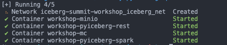
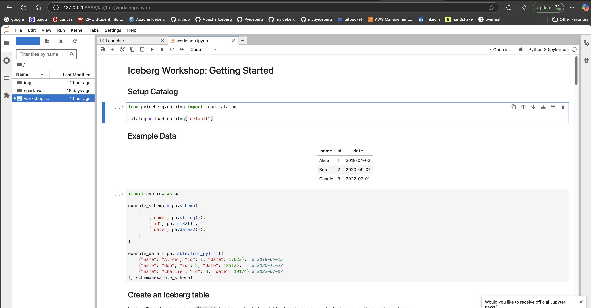
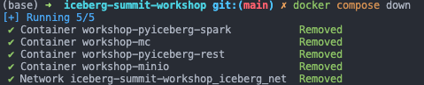

# Iceberg Summit Workshop: Getting Started with Iceberg 🚀

Welcome! Let's dive into Apache Iceberg together in this interactive, hands-on workshop. Whether you're brand-new or already familiar with Iceberg, you'll walk away with practical skills and resources to confidently integrate Iceberg into your data workflows.

We'll explore Iceberg fundamentals, core concepts, and real-world table operations using Python-based tools like PyIceberg and DuckDB. Together, we'll follow data through the entire lifecycle—from ingestion and transformation to multi-engine querying.

This first session is a warm-up focused on clear, easy-to-follow examples of basic table operations with PyIceberg to introduce you to the essentials of Iceberg.

## Alternative Way to Run the Workshop

If you're having trouble installing Docker Desktop on your laptop, don't worry! We've prepared a Google Colab version of the workshop that doesn't require any local setup. Simply click the link below and follow the instructions provided to run the workshop:

- [Iceberg Getting Started Workshop Colab](https://colab.research.google.com/github/HonahX/iceberg-summit-workshop/blob/main/Iceberg_getting_started_colab.ipynb)

## Before You Arrive
Please make sure your laptop is ready:

1. ✅ **Working Laptop:** Ensure you have network connectivity.
2. ✅ **Git Installed:** [Install Git here](https://git-scm.com/downloads).
3. ✅ **Docker Desktop Installed:** We'll use Docker for quick setup. Follow instructions for your system:
   - [Install on Mac](https://docs.docker.com/desktop/setup/install/mac-install/)
   - [Install on Windows](https://docs.docker.com/desktop/setup/install/windows-install/)
   - [Install on Linux](https://docs.docker.com/desktop/setup/install/linux/)

### Optional: Prepare the Workshop Environment in Advance
Want to save time on workshop day? You can build and prepare the environment ahead of time by running:

```
docker compose up -d --build
```
Once you see the following message in your terminal



it means all the containers are setup successfully. You can then shutdown them via
```
docker compose down
```


## How to Run the Workshop

### Step 1: Clone the Workshop Repo
In your terminal, navigate to your desired folder and run:
```bash
git clone https://github.com/HonahX/iceberg-summit-workshop.git
```

### Step 2: Launch the Workshop Environment
Inside the repo directory, start the environment by running:
```bash
docker compose up -d
```
Proceed to the next step once you see


in your terminal.


### Step 3: Access the Workshop Notebook
- Open your favorite web brower
- Type the following address into the address bar:
   - [http://127.0.0.1:8888/lab/tree/workshop.ipynb](http://127.0.0.1:8888/lab/tree/workshop.ipynb)
- Press Enter and you shall the see workshop notebook like below.



## Stopping the Workshop
When you're finished, run the following code in the terminal that ran step 1:
```bash
docker compose down
```
Once you see



every component of the workshop has been shut down.


## Next Part: Iceberg in Production Workshop
Ready to go deeper?

Check out the second part of the workshop focused on production use cases:

[https://github.com/dlt-hub/workshop-iceberg-summit](https://github.com/dlt-hub/workshop-iceberg-summit)

We can't wait to get started—see you there! 🎉
